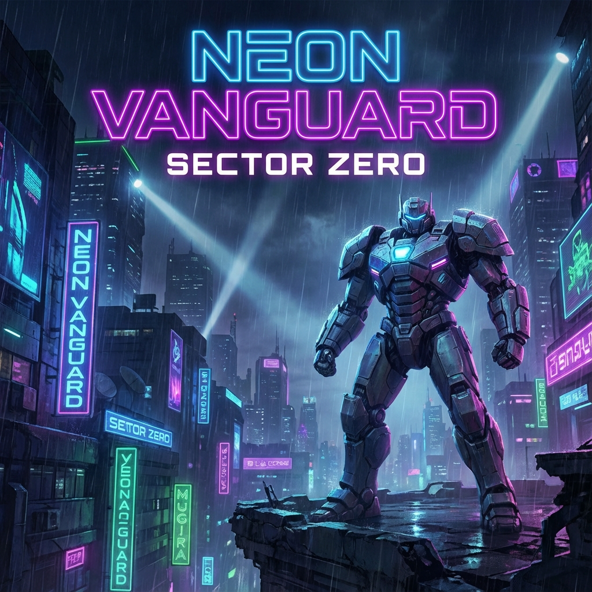

# Neon Vanguard: Sector Zero

[](https://github.com/blal1/neon-vanguard-sector-zero)
[](LICENSE)
[](https://reactjs.org/)
[](https://www.typescriptlang.org/)
[](https://www.electronjs.org/)

> A tactical roguelite mech combat game with deep progression system, full accessibility support, and extensive modding capabilities.


<!-- TODO: Add game banner/screenshot -->

## Table of Contents

- [About](#-about)
- [Features](#-features)
- [Screenshots](#-screenshots)
- [Installation](#-installation)
- [Usage](#-usage)
- [Available Scripts](#-available-scripts)
- [Tech Stack](#-tech-stack)
- [Architecture](#-architecture)
- [Modding](#-modding)
- [Accessibility](#-accessibility)
- [Contributing](#-contributing)
- [License](#-license)
- [Credits](#-credits)

## About

**Neon Vanguard: Sector Zero** is a fast-paced and intense mech combat game built with React and TypeScript. Pilot advanced mechs through dangerous sectors, fight unique enemies, acquire augmentations, and upgrade your equipment to survive increasingly difficult waves.

The game combines **roguelite** mechanics with a dynamic **real-time** combat system, procedural environmental hazards, and a deep talent tree for pilot customization.

### Game Objective

Survive through 5 sectors of increasing difficulty, defeat sector-ending bosses, and unlock new pilots, augmentations, and secrets in the Codex. Test your limits in **Endless Mode** to climb the global leaderboard.

## Features

### Advanced Combat System
- **ATB (Active Time Battle)**: Real-time combat with charge gauge for each enemy
- **Combo System**: Chain attacks for damage multipliers
- **Weak Points**: Exploit enemy vulnerabilities with the right abilities
- **Enemy Intentions**: Anticipate and counter enemy attacks, heals, and defenses
- **Elite Affixes**: Enemies with special modifiers (Volatile, Armored, Vampiric, etc.)

### Unique Pilots
- **5 Playable Pilots**: Each with unique stats, abilities, and mechanics
  - **Vanguard**: Balanced tank with shields
  - **Solaris**: Energy specialist with overcharge
  - **Hydra**: Heat management and DoT damage
  - **Wyrm**: Bio-regeneration and crowd control
  - **Ghost**: Stealth and critical burst damage
- **2 Modules per Pilot**: ASSAULT (offensive) or DEFENSE (defensive)
- **Talent Trees**: Permanent progression system for each pilot

### Game Modes
- **Standard Campaign**: 5 sectors with final bosses
- **Endless Mode**: Infinite wave survival with leaderboard
- **Difficulty Levels**: RECRUIT, VETERAN, ELITE, NIGHTMARE
- **Daily Modifiers**: Boss Rush, Double Hazards, Pacifist

### Progression and Customization
- **Augmentation System**: Over 30 augmentations with synergies
- **Crafting**: Combine consumables to create unique items
- **Achievement System**: 18+ achievements with rewards
- **Loadouts**: Save and load your favorite configurations
- **Detailed Statistics**: Complete performance tracking

### Narrative Content
- **Codex**: Database of pilots, enemies, and lore
- **Narrative Events**: Choices that affect your run
- **Audio Logs**: Discover the sector's history
- **Boss Dialogues**: Unique interactions for each boss

### Advanced Features
- **Replay System**: Record and replay your best battles
- **Dynamic Audio**: Music and sound effects per stage
- **TTS Support**: Voice lines via Web Speech API
- **Multilingual Support**: Integrated i18next system
- **Modding**: Easily add your own enemies, pilots, and events

### Accessibility
- **Full Screen Reader Support**: NVDA compatible
- **Keyboard Navigation**: Complete keyboard controls
- **Colorblind Modes**: 3 modes for different types
- **3D Positional Audio**: Spatial sound orientation
- **Customizable Shortcuts**: Configurable keybindings
- **Performance Options**: Performance mode to reduce visual effects

## Screenshots

<!-- TODO: Add screenshots -->
```
[Main Menu] [Pilot Selection] [Combat] [Hangar] [Talent Tree]
```

## Installation

### Prerequisites

- **Node.js** version 18 or higher ([Download](https://nodejs.org/))
- **npm** (included with Node.js) or **yarn**

### Standard Installation

1. **Clone the repository**:
   ```bash
   git clone https://github.com/blal1/neon-vanguard-sector-zero.git
   cd neon-vanguard-sector-zero
   ```

2. **Install dependencies**:
   ```bash
   npm install
   ```

3. **Generate audio assets** (optional - placeholders):
   ```bash
   npm run generate-audio
   ```

4. **Start the development server**:
   ```bash
   npm run dev
   ```

5. **Open in your browser**: `http://localhost:5173`

### Electron Installation (Desktop Application)

To run the application in desktop mode:

```bash
# Development mode with hot-reload
npm run electron:dev

# Windows production build
npm run electron:build:win
```

The executable will be created in the `release/` folder.

## Usage

### Quick Start

1. **Select a Pilot**: Choose from 5 unique pilots
2. **Choose a Module**: ASSAULT or DEFENSE
3. **Equip Consumables**: Med-Kits, EMP Grenades, etc.
4. **Read the Briefing**: Understand your mission
5. **Launch Combat**: Engage systems!

### Controls

#### Combat
- **Left Click on Enemy**: Basic attack
- **Spacebar**: Primary ability
- **Shift**: Special ability
- **1-4**: Use consumable
- **P**: Pause

#### Navigation
- **Tab**: Navigate between elements
- **Enter**: Select/Confirm
- **Escape**: Back/Cancel
- **F1**: Help/Tutorial

For more details, see [HOW_TO_PLAY.md](HOW_TO_PLAY.md).

## Available Scripts

| Script | Description |
|--------|-------------|
| `npm run dev` | Start Vite development server (port 5173) |
| `npm run build` | Build the application for production in `dist/` |
| `npm run preview` | Preview the production build |
| `npm run test` | Run tests with Vitest |
| `npm run test:ui` | GUI interface for tests |
| `npm run generate-audio` | Generate placeholder audio files |
| `npm run electron:dev` | Start Electron in development mode with hot-reload |
| `npm run electron:build` | Build Electron for production |
| `npm run electron:build:win` | Build Electron specifically for Windows |

## Tech Stack

### Frontend
- **[React 19](https://react.dev/)**: UI library with functional components and hooks
- **[TypeScript 5.8](https://www.typescriptlang.org/)**: Static typing for JavaScript
- **[Vite 6](https://vitejs.dev/)**: Ultra-fast build tool and dev server
- **[Tailwind CSS 3.4](https://tailwindcss.com/)**: Utility-first CSS framework
- **[Framer Motion](https://www.framer.com/motion/)**: Smooth animations and transitions

### State Management
- **[Zustand 5](https://zustand-demo.pmnd.rs/)**: Simple and performant state management
- **React Context**: Global state for GameContext
- **LocalStorage**: Data persistence (profile, settings, runs)

### Desktop Application
- **[Electron 39](https://www.electronjs.org/)**: Cross-platform desktop application framework
- **[electron-builder](https://www.electron.build/)**: Packaging and distribution

### Internationalization & Accessibility
- **[i18next](https://www.i18next.com/)**: Translation system
- **[react-i18next](https://react.i18next.com/)**: React integration for i18n
- **Web Speech API**: Browser-native Text-to-Speech

### Charts & Visualization
- **[Recharts](https://recharts.org/)**: Charts for statistics

### Development Tools
- **[Vitest](https://vitest.dev/)**: Unit testing framework
- **[Testing Library](https://testing-library.com/)**: Utilities for testing React
- **ESLint + Prettier**: Linting and formatting (via Vite configuration)

## Architecture

### Folder Structure

```
neon-vanguard-sector-zero/
├── components/          # Reusable React components (44 files)
│   ├── CombatScreen.tsx
│   ├── HangarScreen.tsx
│   ├── CharacterSelect.tsx
│   └── ...
├── constants/           # Configuration and static data
│   ├── achievements.ts
│   ├── augmentations.ts
│   ├── colors.ts
│   ├── talents.ts
│   └── ...
├── context/             # React Context providers
│   └── GameContext.tsx
├── data/                # Pilot data manager
│   └── dataManager.ts
├── docs/                # Documentation
│   ├── ARCHITECTURE.md
│   ├── API_REFERENCE.md
│   └── FEATURES.md
├── electron/            # Electron configuration
│   └── main.cjs
├── hooks/               # Custom React hooks
│   └── useKeyboardNavigation.ts
├── mods/                # Modding system
│   ├── enemies/
│   ├── pilots/
│   └── events/
├── public/              # Static assets
│   └── audio/           # Audio files
├── services/            # Services and utilities
│   ├── audioService.ts
│   ├── ttsService.ts
│   └── voiceLineService.ts
├── src/                 # Main source code
│   ├── i18n/            # Translations
│   └── test/            # Test configuration
├── types/               # TypeScript definitions
│   ├── codex.ts
│   ├── replay.ts
│   └── talents.ts
├── utils/               # Utility functions
│   ├── combatUtils.ts
│   ├── synergyUtils.ts
│   └── ...
├── App.tsx              # Main component
├── index.tsx            # React entry point
├── types.ts             # Global types
├── constants.ts         # Global constants
└── package.json
```

For more details, see [docs/ARCHITECTURE.md](docs/ARCHITECTURE.md).

### Data Flow

1. **GameContext** (Zustand + React Context) manages global state
2. **LocalStorage** persists data between sessions
3. **Services** (audio, TTS) communicate with browser APIs
4. **Utilities** perform combat calculations and synergies
5. **Components** consume and display state

## Modding

Neon Vanguard supports modding via simple JSON/TypeScript files!

### Add an Enemy

Create `mods/enemies/my-enemy.json`:
```json
{
  "name": "DEVASTATOR",
  "maxHp": 150,
  "speed": 1.2,
  "damage": 25,
  "flavorText": "Launches a missile salvo.",
  "scrapValue": 40
}
```

### Add a Pilot

Create `mods/pilots/my-pilot.json` with custom abilities.

### Add an Event

Create `mods/events/my-event.ts` with choices and consequences.

For the complete guide, see [MODDING_GUIDE.md](MODDING_GUIDE.md).

## Accessibility

This game is designed to be **fully accessible** to players using screen readers:

- ✅ Full NVDA support
- ✅ Complete keyboard navigation
- ✅ ARIA announcements with priorities
- ✅ 3D spatial audio for orientation
- ✅ Colorblind modes (protanopia, deuteranopia, tritanopia)
- ✅ Customizable keybindings
- ✅ Performance mode (reduced animations)

Voice lines use the browser's **Web Speech API** (works best on Chrome/Edge).

## Contributing

Contributions are welcome! Here's how to participate:

1. **Fork** the project
2. **Create a branch** for your feature (`git checkout -b feature/AmazingFeature`)
3. **Commit** your changes (`git commit -m 'Add: Amazing feature'`)
4. **Push** to the branch (`git push origin feature/AmazingFeature`)
5. **Open a Pull Request**

See [CONTRIBUTING.md](CONTRIBUTING.md) for detailed guidelines.

### Report Bugs

Use [GitHub Issues](https://github.com/blal1/neon-vanguard-sector-zero/issues) with the bug report template.

### Suggest Features

Use GitHub Issues with the feature request template.

## License

This project is licensed under the **MIT** license. See [LICENSE](LICENSE) for more details.

## Credits

### Development
- **Lead Developer**: Bilal

### Technologies
- Built with [React](https://react.dev/), [TypeScript](https://www.typescriptlang.org/), and [Vite](https://vitejs.dev/)
- Powered by [Electron](https://www.electronjs.org/)

### Audio
- Placeholder audio generated via Node.js scripts
- TTS via Web Speech API

### Special Thanks
- React and TypeScript community
- All contributors and testers

---

## Contact & Support

- **GitHub Issues**: [Bug Reports & Features](https://github.com/yourusername/neon-vanguard-sector-zero/issues)
- **Discord**: [Neon Vanguard Community](#) <!-- TODO: Add Discord link if applicable -->
- **Email**: bilalfehan2006@gmail.com <!-- TODO: Add email -->

---

<div align="center">

**⚡ Made with ❤️ for the gaming and accessibility community ⚡**

[⬆ Back to top](#-neon-vanguard-sector-zero)

</div>