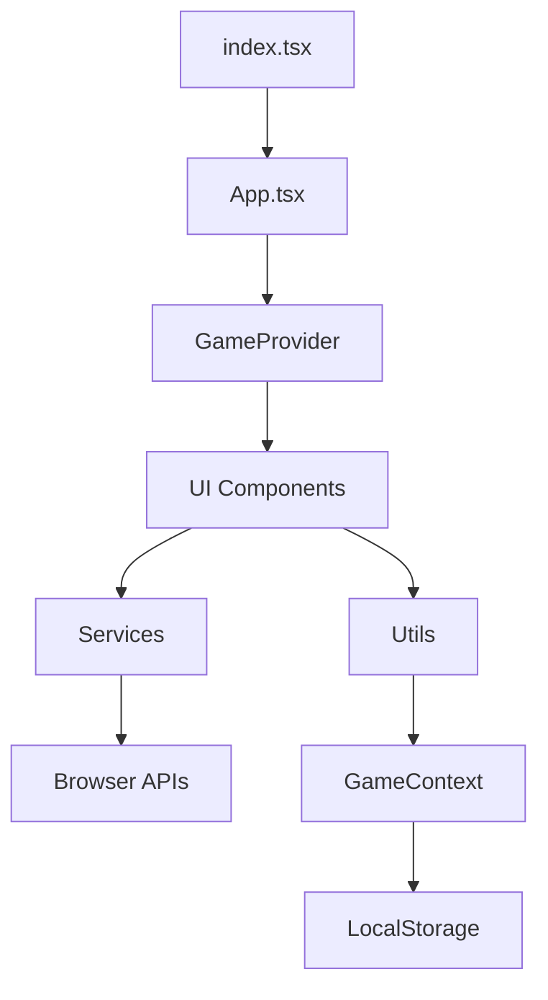
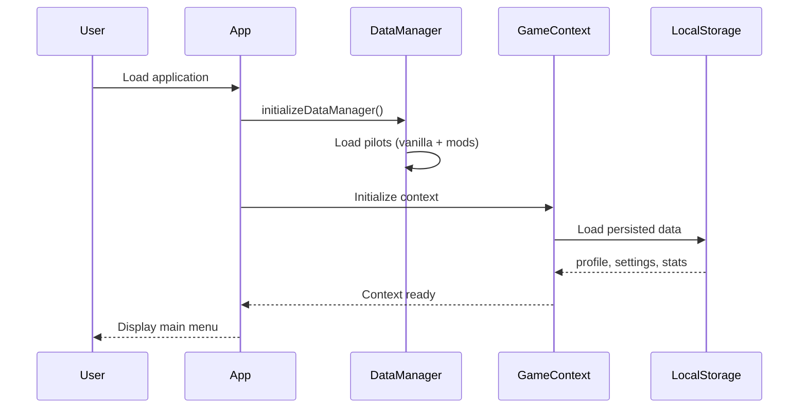
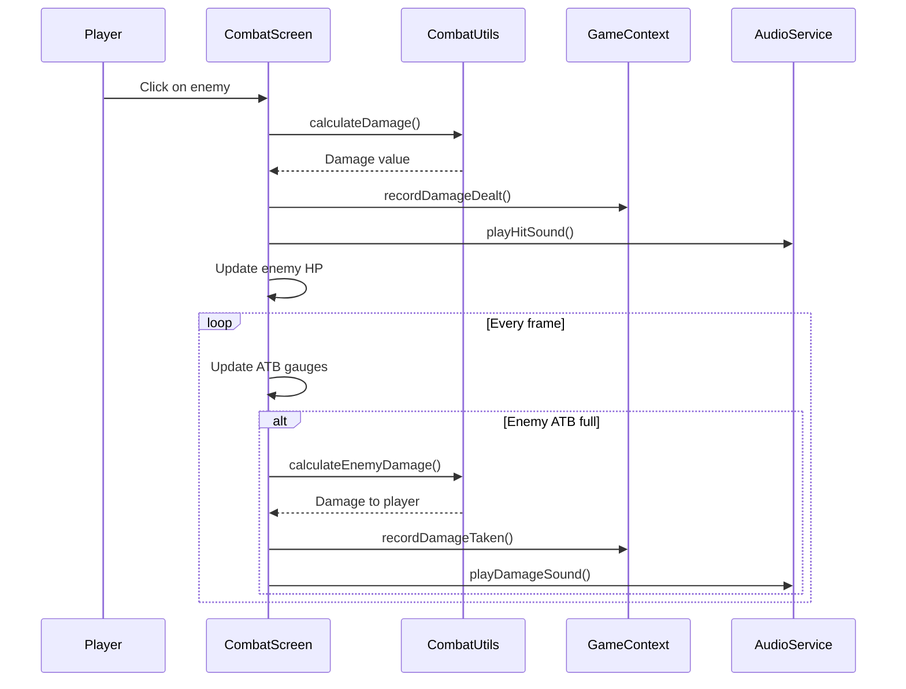

# Project Architecture

This document describes the technical architecture of **Neon Vanguard: Sector Zero**.

## 📐 Overview

Neon Vanguard is a **single-page React application (SPA)** built with TypeScript and Vite, packaged as a desktop application via Electron. The architecture follows a **Component-Based** model with centralized state management.



## 🗂 Folder Structure

### Project Root

```
neon-vanguard_-sector-zero/
├── components/          # React UI components (44 files)
├── constants/           # Configuration and static data
├── context/             # React Context providers
├── data/                # Dynamic data manager
├── docs/                # Documentation
├── electron/            # Electron configuration
├── hooks/               # Custom React hooks
├── mods/                # Modding system
├── public/              # Static assets
├── services/            # Services (audio, TTS, voice)
├── src/                 # Additional source code
├── types/               # Additional TypeScript definitions
├── utils/               # Utility functions
├── App.tsx              # Root component
├── constants.ts         # Global constants
├── index.css            # Global styles (Tailwind + custom)
├── index.tsx            # React entry point
├── types.ts             # Main global types
├── package.json         # npm configuration
├── tsconfig.json        # TypeScript configuration
└── vite.config.ts       # Vite configuration
```

### Folder Details

#### `/components` (44 files)

React components organized by functionality:

| Component | Description |
|-----------|-------------|
| `CombatScreen.tsx` | Main combat screen (ATB, enemies, logs) |
| `HangarScreen.tsx` | Shop and upgrades between sectors |
| `CharacterSelect.tsx` | Pilot + module + loadout selection |
| `EndlessWaveScreen.tsx` | Endless mode with upgrades |
| `AchievementsScreen.tsx` | Achievement gallery |
| `TalentTreeScreen.tsx` | Talent tree per pilot |
| `CodexScreen.tsx` | Lore/enemy database |
| `ReplayViewer.tsx` | Recorded combat player |
| `StatsScreen.tsx` | Detailed statistics |
| `SettingsScreen.tsx` | Audio/visual/gameplay configuration |
| ... | + 34 other components |

**Patterns Used**:
- Functional components with hooks
- Props typed with TypeScript interfaces
- Composition over inheritance
- Separation of concerns (presentation vs logic)

#### `/constants`

Game configuration and static data:

- `achievements.ts`: Definitions for 18 achievements
- `augmentations.ts`: 30+ augmentations with effects
- `talents.ts`: Talent trees for each pilot
- `colors.ts`: Color palettes (colorblind support)
- `codex.ts`: Lore entries and Codex data

#### `/context`

React Context for global state management:

- **`GameContext.tsx`**: Main context with Zustand
  - Manages: profile, settings, runState, stats, achievements
  - Provides: Actions to modify state
  - Persists: Automatic LocalStorage saving

#### `/data`

Dynamic data manager:

- **`dataManager.ts`**: Loads pilots from `/mods/pilots/`
- Allows adding custom pilots via JSON
- Async initialization at startup

#### `/services`

Services for external interactions:

- **`audioService.ts`**: Audio management (music, SFX)
  - Asset preloading
  - Master/music/sfx volume control
  - Play/stop/pause for each sound
  
- **`ttsService.ts`**: Text-to-Speech via Web Speech API
  - Game event text reading
  - Voice support per language
  - Fallback if TTS unavailable
  
- **`voiceLineService.ts`**: Pilot voice lines
  - Contextual voice lines (combat, victory, defeat)
  - Priority system
  - Playback queue

#### `/utils`

Pure utility functions:

- **`combatUtils.ts`**: Combat logic
  - Damage calculation (base, critical, weak point)
  - Consumable application
  - Status management (stun, burning, etc.)
  - ATB charge rate
  
- **`synergyUtils.ts`**: Synergy system
  - Active synergy detection
  - Combined effect application
  
- **`achievementUtils.ts`**: Achievement unlocking
- **`talentUtils.ts`**: Talent application
- **`codexUtils.ts`**: Codex entry unlocking

#### `/types`

Modular TypeScript definitions:

- `codex.ts`: Codex system types
- `replay.ts`: Replay system types
- `talents.ts`: Talent tree types
- Complements `types.ts` (global types)

#### `/mods`

Extensible modding system:

```
mods/
├── enemies/
│   └── berserker.json
├── pilots/
│   └── ghost.json
└── events/
    └── derelict-ship.ts
```

Files are automatically loaded at startup.

## 🔄 Data Flow

### 1. Initialization



### 2. Combat Loop



### 3. Persistence

`GameContext` uses **`useEffect`** to auto-save to LocalStorage:

```typescript
useEffect(() => {
  localStorage.setItem('neonvanguard_profile', JSON.stringify(profile));
  localStorage.setItem('neonvanguard_settings', JSON.stringify(settings));
  localStorage.setItem('neonvanguard_stats', JSON.stringify(stats));
  // ...
}, [profile, settings, stats, ...]);
```

**LocalStorage Keys**:
- `neonvanguard_profile`: XP, level, kills
- `neonvanguard_settings`: Audio/visual settings
- `neonvanguard_runstate`: Active run (allows continue)
- `neonvanguard_stats`: Detailed statistics
- `neonvanguard_achievements`: Unlocked achievements
- `neonvanguard_loadouts`: Saved configurations
- `neonvanguard_codex`: Unlocked codex entries
- `neonvanguard_replays`: Recorded replays
- `neonvanguard_talents`: Unlocked talents

## 🎯 Architectural Patterns

### Component Composition

Complex screens are composed of sub-components:

```
CombatScreen
├── EnemyList
│   └── Enemy (x N)
├── PlayerStats
├── AbilityBar
├── ConsumableBar
└── CombatLog
```

### Render Props & Hooks

Reusable logic via custom hooks:

```typescript
// Hook for keyboard navigation
const useKeyboardNavigation = (enabled: boolean) => {
  useEffect(() => {
    const handleKeyDown = (e: KeyboardEvent) => {
      // Logic...
    };
    if (enabled) {
      window.addEventListener('keydown', handleKeyDown);
    }
    return () => window.removeEventListener('keydown', handleKeyDown);
  }, [enabled]);
};
```

### State Management with Zustand

`GameContext` uses Zustand for performant state:

```typescript
const useGameStore = create<GameState>((set, get) => ({
  profile: initialProfile,
  settings: initialSettings,
  
  addXp: (amount) => set((state) => ({
    profile: { ...state.profile, xp: state.profile.xp + amount }
  })),
  
  // ... other actions
}));
```

**Benefits**:
- ✅ Fewer re-renders than Context alone
- ✅ Simple syntax
- ✅ Integrated DevTools
- ✅ Easy to test

### Service Pattern

Services encapsulate external interactions:

```typescript
class AudioService {
  private sounds: Map<string, HTMLAudioElement>;
  private musicVolume: number;
  
  async preload(urls: string[]) { /* ... */ }
  play(soundId: string) { /* ... */ }
  setVolume(volume: number) { /* ... */ }
}

export const audio = new AudioService();
```

## 🔌 Electron Integration

### Main Process (`electron/main.cjs`)

```javascript
const { app, BrowserWindow } = require('electron');
const path = require('path');
const isDev = require('electron-is-dev');

function createWindow() {
  const win = new BrowserWindow({
    width: 1280,
    height: 720,
    webPreferences: {
      nodeIntegration: false,
      contextIsolation: true,
    }
  });

  if (isDev) {
    win.loadURL('http://localhost:5173');
  } else {
    win.loadFile(path.join(__dirname, '../dist/index.html'));
  }
}

app.whenReady().then(createWindow);
```

### Build Configuration

**`package.json`**:
```json
{
  "main": "electron/main.cjs",
  "scripts": {
    "electron:dev": "concurrently \"npm run dev\" \"wait-on http://localhost:5173 && electron .\"",
    "electron:build": "npm run build && electron-builder"
  },
  "build": {
    "appId": "com.neonvanguard.sectorzero",
    "files": ["dist/**/*", "electron/**/*", "package.json"],
    "directories": {
      "buildResources": "public",
      "output": "release"
    }
  }
}
```

## 🧪 Testing Strategy

### Unit Tests (Vitest)

Tests for utils and pure logic:

```typescript
// combatUtils.test.ts
describe('calculateDamage', () => {
  it('calculates base damage correctly', () => {
    const result = calculateDamage(100, 1.0, false);
    expect(result).toBe(100);
  });
  
  it('applies critical multiplier', () => {
    const result = calculateDamage(100, 1.0, true);
    expect(result).toBe(150); // 1.5x crit
  });
});
```

### Component Tests (Testing Library)

Integration tests for components:

```typescript
// CharacterSelect.test.tsx
describe('CharacterSelect', () => {
  it('displays all unlocked pilots', () => {
    render(<CharacterSelect onSelect={vi.fn()} />);
    expect(screen.getByText('VANGUARD')).toBeInTheDocument();
    expect(screen.getByText('SOLARIS')).toBeInTheDocument();
  });
});
```

## 🚀 Build & Deployment

### Development

```bash
npm run dev            # Vite dev server (port 5173)
npm run electron:dev   # Electron + hot reload
```

### Production Build

```bash
npm run build                # Build web (dist/)
npm run electron:build:win   # Build Electron Windows
```

**Outputs**:
- `dist/`: Web build (deployable to hosting)
- `release/`: Electron executables (.exe, .dmg, etc.)

## 📖 Related Documentation

- [API Reference](API_REFERENCE.md) - Complete GameContext API
- [Features](FEATURES.md) - Game systems documentation
- [Modding Guide](../MODDING_GUIDE.md) - Content creation guide
- [Contributing](../CONTRIBUTING.md) - Contribution guide

---

**Last Updated**: 2025-12-11
