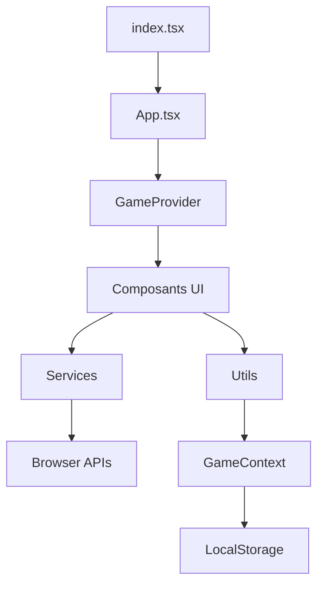
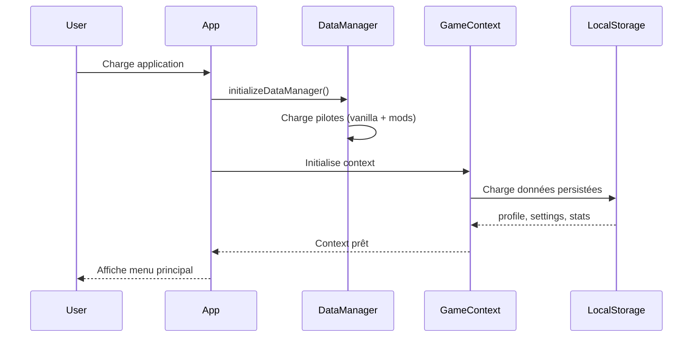

# Architecture du Projet

Ce document décrit l'architecture technique de **Neon Vanguard: Sector Zero**.

## 📐 Vue d'Ensemble

Neon Vanguard est une application **React monopage (SPA)** construite avec TypeScript et Vite, packagée comme application desktop via Electron. L'architecture suit un modèle **Component-Based** avec state management centralisé.



## 🗂 Structure des Dossiers

### Racine du Projet

```
neon-vanguard_-sector-zero/
├── components/          # Composants React UI (44 fichiers)
├── constants/           # Configuration et données statiques
├── context/             # React Context providers
├── data/                # Gestionnaire de données dynamiques
├── docs/                # Documentation
├── electron/            # Configuration Electron
├── hooks/               # Custom React hooks
├── mods/                # Système de modding
├── public/              # Assets statiques
├── services/            # Services (audio, TTS, voice)
├── src/                 # Code source additionnel
├── types/               # Définitions TypeScript additionnelles
├── utils/               # Fonctions utilitaires
├── App.tsx              # Composant racine
├── constants.ts         # Constantes globales
├── index.css            # Styles globaux (Tailwind + custom)
├── index.tsx            # Point d'entrée React
├── types.ts             # Types globaux principaux
├── package.json         # Configuration npm
├── tsconfig.json        # Configuration TypeScript
└── vite.config.ts       # Configuration Vite
```

### Détails des Dossiers

#### `/components` (44 fichiers)

Composants React organisés par fonctionnalité:

| Composant | Description |
|-----------|-------------|
| `CombatScreen.tsx` | Écran de combat principal (ATB, ennemis, logs) |
| `HangarScreen.tsx` | Shop et upgrades entre secteurs |
| `CharacterSelect.tsx` | Sélection pilote + module + loadouts |
| `EndlessWaveScreen.tsx` | Mode endless avec upgrades |
| `AchievementsScreen.tsx` | Galerie d'achievements |
| `TalentTreeScreen.tsx` | Arbre de talents par pilote |
| `CodexScreen.tsx` | Base de données lore/ennemis |
| `ReplayViewer.tsx` | Rejoueur de combats enregistrés |
| `StatsScreen.tsx` | Statistiques détaillées |
| `SettingsScreen.tsx` | Configuration audio/visuel/gameplay |
| ... | + 34 autres composants |

**Patterns utilisés**:
- Composants fonctionnels avec hooks
- Props typées avec TypeScript interfaces
- Composition plutôt qu'héritage
- Separation of Concerns (présentation vs logique)

#### `/constants`

Configuration et données statiques du jeu:

- `achievements.ts`: Définitions des 18 achievements
- `augmentations.ts`: 30+ augmentations avec effets
- `talents.ts`: Arbres de talents pour chaque pilote
- `colors.ts`: Palettes de couleurs (daltonisme)
- `codex.ts`: Entrées de lore et données Codex

#### `/context`

React Context pour state management global:

- **`GameContext.tsx`**: Context principal avec Zustand
  - Gère: profile, settings, runState, stats, achievements
  - Fournit: Actions pour modifier l'état
  - Persiste: LocalStorage automatique

#### `/data`

Gestionnaire de données dynamiques:

- **`dataManager.ts`**: Charge pilotes depuis `/mods/pilots/`
- Permet ajout de pilotes custom via JSON
- Initialisation async au démarrage

#### `/services`

Services pour interactions externes:

- **`audioService.ts`**: Gestion audio (musique, SFX)
  - Preload des assets
  - Contrôle volume master/music/sfx
  - Play/stop/pause pour chaque son
  
- **`ttsService.ts`**: Text-to-Speech via Web Speech API
  - Lecture de texte game events
  - Support voix par langue
  - Fallback si TTS indisponible
  
- **`voiceLineService.ts`**: Voice lines des pilotes
  - Voice lines contextuelles (combat, victory, defeat)
  - Système de priorités
  - Queue de lectures

#### `/utils`

Fonctions utilitaires pures:

- **`combatUtils.ts`**: Logique de combat
  - Calcul dégâts (base, critique, weak point)
  - Application consumables
  - Gestion statuts (stun, burning, etc.)
  - ATB charge rate
  
- **`synergyUtils.ts`**: Système de synergies
  - Détection synergies actives
  - Application effets combinés
  
- **`achievementUtils.ts`**: Unlock achievements
- **`talentUtils.ts`**: Application talents
- **`codexUtils.ts`**: Unlock codex entries

#### `/types`

Définitions TypeScript modulaires:

- `codex.ts`: Types pour système Codex
- `replay.ts`: Types pour système replay
- `talents.ts`: Types pour arbres de talents
- Complète `types.ts` (types globaux)

#### `/mods`

Système de modding extensible:

```
mods/
├── enemies/
│   └── berserker.json
├── pilots/
│   └── ghost.json
└── events/
    └── derelict-ship.ts
```

Les fichiers sont automatiquement chargés au démarrage.

## 🔄 Flux de Données

### 1. Initialisation



### 2. Combat Loop


### 3. Persistence

Le `GameContext` utilise **`useEffect`** pour auto-save dans LocalStorage:

```typescript
useEffect(() => {
  localStorage.setItem('neonvanguard_profile', JSON.stringify(profile));
  localStorage.setItem('neonvanguard_settings', JSON.stringify(settings));
  localStorage.setItem('neonvanguard_stats', JSON.stringify(stats));
  // ...
}, [profile, settings, stats, ...]);
```

**Keys LocalStorage**:
- `neonvanguard_profile`: XP, level, kills
- `neonvanguard_settings`: Settings audio/visuel
- `neonvanguard_runstate`: Run actif (permet continue)
- `neonvanguard_stats`: Statistiques détaillées
- `neonvanguard_achievements`: Achievements unlocked
- `neonvanguard_loadouts`: Configurations sauvegardées
- `neonvanguard_codex`: Codex entries unlocked
- `neonvanguard_replays`: Replays enregistrés
- `neonvanguard_talents`: Talents débloqués

## 🎯 Patterns Architecturaux

### Component Composition

Les écrans complexes sont composés de sous-composants:

```
CombatScreen
├── EnemyList
│   └── Enemy (x N)
├── PlayerStats
├── AbilityBar
├── ConsumableBar
└── CombatLog
```

### Render Props & Hooks

Logique réutilisable via custom hooks:

```typescript
// Hook pour navigation clavier
const useKeyboardNavigation = (enabled: boolean) => {
  useEffect(() => {
    const handleKeyDown = (e: KeyboardEvent) => {
      // Logic...
    };
    if (enabled) {
      window.addEventListener('keydown', handleKeyDown);
    }
    return () => window.removeEventListener('keydown', handleKeyDown);
  }, [enabled]);
};
```

### State Management avec Zustand

Le `GameContext` utilise Zustand pour state performant:

```typescript
const useGameStore = create<GameState>((set, get) => ({
  profile: initialProfile,
  settings: initialSettings,
  
  addXp: (amount) => set((state) => ({
    profile: { ...state.profile, xp: state.profile.xp + amount }
  })),
  
  // ... autres actions
}));
```

**Avantages**:
- ✅ Moins de re-renders que Context seul
- ✅ Syntaxe simple
- ✅ DevTools intégrés
- ✅ Facile à tester

### Service Pattern

Les services encapsulent les interactions externes:

```typescript
class AudioService {
  private sounds: Map<string, HTMLAudioElement>;
  private musicVolume: number;
  
  async preload(urls: string[]) { /* ... */ }
  play(soundId: string) { /* ... */ }
  setVolume(volume: number) { /* ... */ }
}

export const audio = new AudioService();
```

## 🔌 Intégration Electron

### Main Process (`electron/main.cjs`)

```javascript
const { app, BrowserWindow } = require('electron');
const path = require('path');
const isDev = require('electron-is-dev');

function createWindow() {
  const win = new BrowserWindow({
    width: 1280,
    height: 720,
    webPreferences: {
      nodeIntegration: false,
      contextIsolation: true,
    }
  });

  if (isDev) {
    win.loadURL('http://localhost:5173');
  } else {
    win.loadFile(path.join(__dirname, '../dist/index.html'));
  }
}

app.whenReady().then(createWindow);
```

### Build Configuration

**`package.json`**:
```json
{
  "main": "electron/main.cjs",
  "scripts": {
    "electron:dev": "concurrently \"npm run dev\" \"wait-on http://localhost:5173 && electron .\"",
    "electron:build": "npm run build && electron-builder"
  },
  "build": {
    "appId": "com.neonvanguard.sectorzero",
    "files": ["dist/**/*", "electron/**/*", "package.json"],
    "directories": {
      "buildResources": "public",
      "output": "release"
    }
  }
}
```

## 🧪 Testing Strategy

### Unit Tests (Vitest)

Tests pour utils et logique pure:

```typescript
// combatUtils.test.ts
describe('calculateDamage', () => {
  it('calculates base damage correctly', () => {
    const result = calculateDamage(100, 1.0, false);
    expect(result).toBe(100);
  });
  
  it('applies critical multiplier', () => {
    const result = calculateDamage(100, 1.0, true);
    expect(result).toBe(150); // 1.5x crit
  });
});
```

### Component Tests (Testing Library)

Tests d'intégration pour composants:

```typescript
// CharacterSelect.test.tsx
describe('CharacterSelect', () => {
  it('displays all unlocked pilots', () => {
    render(<CharacterSelect onSelect={vi.fn()} />);
    expect(screen.getByText('VANGUARD')).toBeInTheDocument();
    expect(screen.getByText('SOLARIS')).toBeInTheDocument();
  });
});
```

## 🚀 Build & Deployment

### Development

```bash
npm run dev            # Vite dev server (port 5173)
npm run electron:dev   # Electron + hot reload
```

### Production Build

```bash
npm run build                # Build web (dist/)
npm run electron:build:win   # Build Electron Windows
```

**Outputs**:
- `dist/`: Build web (déployable sur hosting)
- `release/`: Executables Electron (.exe, .dmg, etc.)

## 📖 Documentation Associée

- [API Reference](API_REFERENCE.md) - API complète du GameContext
- [Features](FEATURES.md) - Documentation des systèmes de jeu
- [Modding Guide](../MODDING_GUIDE.md) - Guide de création de contenu
- [Contributing](../CONTRIBUTING.md) - Guide de contribution

---

**Dernière mise à jour**: 2025-12-09
